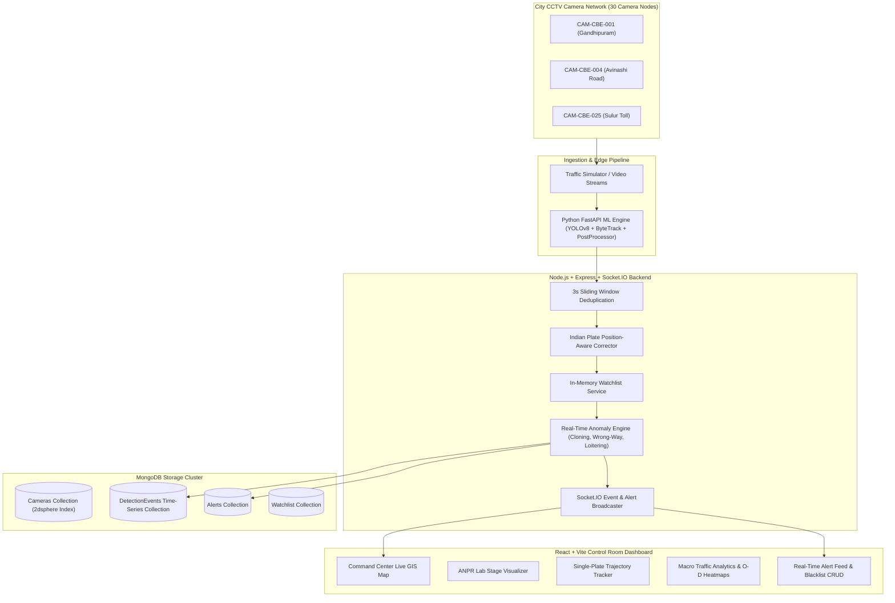

# NetraTrack Architecture Specification

NetraTrack is a production-grade, city-wide AI engine for multi-camera Automatic Number Plate Recognition (ANPR), single-plate trajectory tracking, macro urban traffic analytics, and real-time security alerting.

---

## 1. System Architecture Overview

---

## 2. Ingestion & Preprocessing Pipeline

1. **Detection & Cropping**: Edge / YOLOv8 plate detector crops license plate region.
2. **Hard-Condition Preprocessing**:
   - **CLAHE**: Enhances low-light and night vision.
   - **Deskew**: Perspective warp correction using contour minimum area rects.
   - **Sharpening**: Laplacian / unsharp mask for motion blur.
   - **Denoising**: Bilateral filter.
3. **Indian Post-Processing Rules**:
   - Validates Indian state codes (`TN`, `KA`, `KL`, `MH`, `DL`, etc.) and `BH` series (`22BH9876AA`).
   - Position-aware character repair: letters forced in state/series slots; digits forced in district/number slots.
   - 2-row plate stacking.
4. **Multi-Frame Sequence Consensus**:
   - ByteTrack tracks vehicle bounding box across consecutive frames.
   - Accumulates OCR candidate strings and outputs consensus plate string weighted by frame OCR confidence scores.

---

## 3. Real-Time Security Anomaly Rules

- **Impossible Speed (Plate Cloning)**: Triggers when the geodesic speed calculated between two consecutive sightings of the same plate exceeds 160 km/h in urban traffic.
- **Wrong-Way Travel**: Triggers when a vehicle travels in opposition to designated one-way camera corridors.
- **Loitering**: Triggers when a plate is detected >= 3 times at the same camera within a 15-minute sliding window.
- **Low Confidence Repeated Sightings**: Flags plates with repeated low OCR confidence (< 60%) for manual operator review.

---

## 4. Single-Plate Trajectory & Route Inference

- **Exact & Fuzzy Search**: Standard exact match + Levenshtein distance fallback (OCR confusion weighted).
- **Graph Route Inference**: Computes Dijkstra shortest path on the city `RoadGraph` between consecutive camera sightings, rendering estimated dashed route polyline alongside solid observed camera hits.
